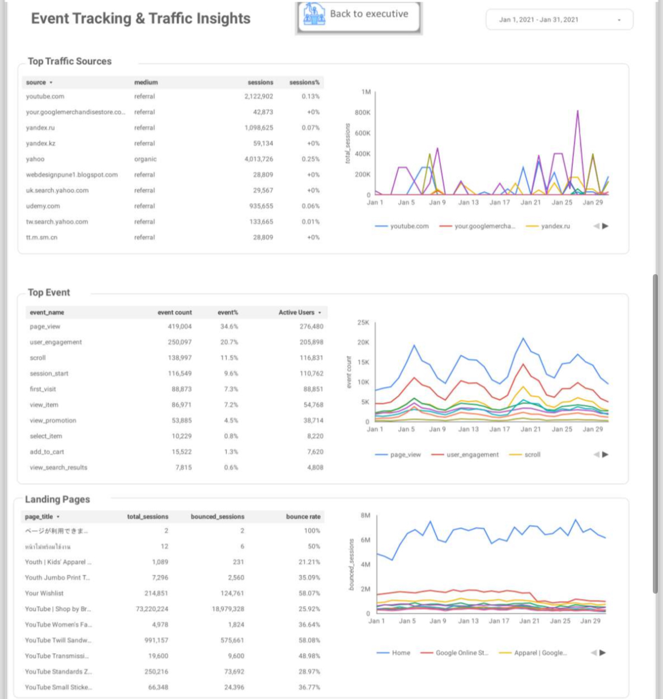

# Web Analytics Accelerator  
GA4 → BigQuery → Looker Studio

## Overview
This project demonstrates how raw GA4 event data is transformed into
analysis-ready datasets using BigQuery and visualized using Looker Studio.

The focus is on data modeling, SQL transformations, and analytics
engineering practices rather than dashboard visuals alone.

## Architecture
GA4 → BigQuery (raw events) → SQL transformations → Looker Studio dashboards

## Key Work
- GA4 event data transformation using BigQuery SQL
- Session-level and user-level modeling
- Reusable analytical tables
- Business-focused dashboards

## Dashboard Preview

### Executive Summary

### User & Traffic Analysis

### Performance & Revenue

### User Demographics & Technology

## Skills Demonstrated
- GA4 data modeling
- BigQuery SQL (UNNEST, SAFE_DIVIDE)
- Analytics engineering
- Dashboard storytelling
